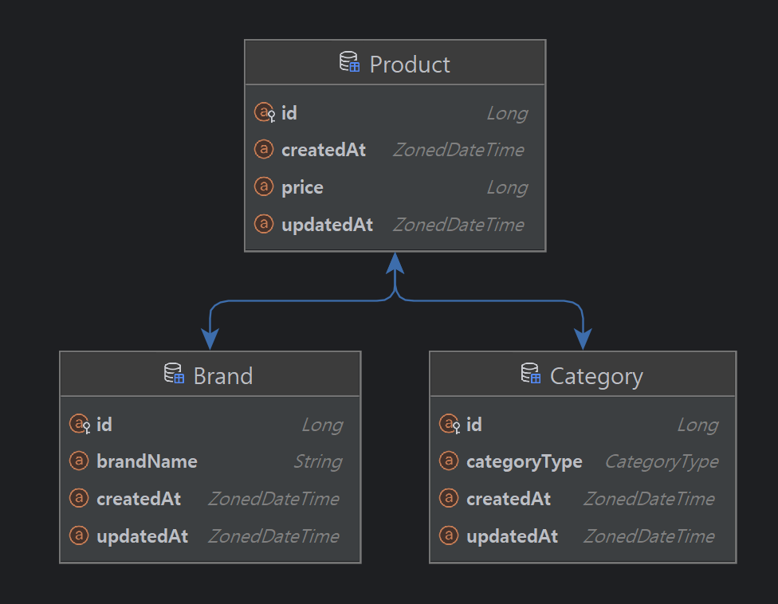

# 상품 코디 서비스


##### 목차
* [프로젝트 개요](#프로젝트-개요)
* [구현 기능 설명](#구현-기능-설명)
* [설치 및 실행](#설치-및-실행)
* [테스트](#테스트)
  * [단위 테스트](#단위-테스트)
  * [통합 테스트](#통합-테스트)
  * [e2e 테스트](#e2e-테스트)
* [REST API 정의](#REST-API-정의)
  * [상품 도메인](#상품-도메인)
  * [브랜드 도메인](#브랜드-도메인)
* [실패 응답 정의](#실패-응답-정의)
* [에러 코드 정의](#에러-코드-정의)

### 프로젝트 개요
고객은 단일 상품 혹은 상품 여러 개로 구성된 코디 세트의 정보를 조회하고, 브랜드 관리자가 브랜드 및 상품을 관리할 수 있습니다.   
각 카테고리는 카테고리 타입으로 구분되며, TOP("상의"), OUTER("아우터"), BOTTOM("하의"), SNEAKERS("스니커즈"), BAG("가방"), HAT("모자"), SOCKS("양말"), ACCESSORY("액세서리") 8개로 구성되어 있습니다.   


### 구현 기능 설명

#### 1. 카테고리별 최저가격 상품으로 구성된 코디 정보 조회   
각 카테고리별 가격이 가장 낮은 상품으로 구성된 코디 정보를 제공합니다. 응답에는 각 상품의 브랜드, 카테고리, 가격과 코디의 총액을 포함합니다.   
각 카테고리별 상품이 최소 1개 이상 등록되어 있지 않거나, 카테고리가 존재하지 않아 코디 정보를 조회할 수 없는 경우 에러를 반환합니다.   
[카테고리별 최저가격 상품으로 구성된 코디 정보 조회 API](#1-카테고리별-최저가격-상품으로-구성된-코디-정보-조회)    

#### 2. 단일 브랜드로 전체 카테고리 상품을 구매할 경우, 상품 가격 총액이 가장 낮은 브랜드의 코디 정보 조회   
단일 브랜드로 전체 카테고리 상품을 구매할 경우, 상품 가격 총액이 가장 낮은 브랜드의 코디 정보를 제공합니다.   
응답에는 브랜드 이름, 각 카테고리 상품의 정보(카테고리 타입, 상품 가격), 상품 가격 총액을 포함합니다.

이때 각 카테고리 상품을 최소 1개 이상 보유한 브랜드여야하며, 모든 브랜드에 각 카테고리 상품이 1개 이상 등록되어 있지 않은 경우 등 코디 정보를 조회할 수 없는 경우 에러를 반환합니다.   
[단일 브랜드로 전체 카테고리 상품을 구매할 경우, 상품 가격 총액이 가장 낮은 브랜드의 코디 정보 조회 API](#2-단일-브랜드로-전체-카테고리-상품을-구매할-경우-상품-가격-총액이-가장-낮은-브랜드의-코디-정보-조회)    

#### 3. 카테고리별 최저, 최고 가격 상품 정보 조회   
특정 카테고리에 등록된 상품 중 가격이 가장 낮은 상품과 높은 상품의 정보(카테고리, 브랜드, 상품 가격)를 제공합니다.    
카테고리 타입(String 타입)으로 조회하며, 해당 카테고리가 존재하지 않거나 카테고리에 등록된 상품이 없는 경우 에러를 반환합니다.   
[카테고리별 최저, 최고 가격 상품 정보 조회](#3-카테고리별-최저-최고-가격-상품-정보-조회)

#### 4. 브랜드 조회, 등록, 수정, 삭제
브랜드를 조회, 등록, 수정, 삭제할 수 있습니다.    
[브랜드 조회 API](#1-브랜드-조회)   
[브랜드 등록 API](#2-브랜드-등록)    
[브랜드 수정 API](#3-브랜드-수정)    
[브랜드 삭제 API](#4-브랜드-삭제)    

#### 5. 상품 조회, 등록, 수정, 삭제
상품을 조회, 등록, 수정, 삭제할 수 있습니다. 상품은 반드시 1개 카테고리와 1개 브랜드에 속해야 합니다.   
[상품 조회 API](#4-상품-조회)   
[상품 등록 API](#5-상품-등록)   
[상품 수정 API](#6-상품-수정)   
[상품 삭제 API](#7-상품-삭제)   

## 설치 및 실행
개발 환경: JDK 17, Spring Boot 3.3.4 
```shell
$ git clone https://github.com/limminjeong98/demo-product-service.git   
$ cd demo-product-service
$ ./gradlew build
$ java -jar build/libs/demo-product-service-0.0.1-SNAPSHOT.jar
```
기본적으로 resources/db에 있는 schema.sql과 data.sql이 순서대로 실행되어 테스트에 필요한 모든 데이터가 세팅됩니다.   
만약 테이블은 생성하되 데이터는 생성하지 않은 상태로 실행하고 싶으시면 application.yml의 spring.sql.init.data-locations를 주석처리하고 실행하시면 됩니다.   

## 테스트
### 단위 테스트
단위 테스트는 서비스, 리포지토리, 퍼사드 레이어 3계층에 대해 작성했습니다.   
서비스와 퍼사드 레이어에서는 Spy로 동작하는 리포지토리 테스트 스텁(~RepositoryStub)을 사용하였고, 리포지토리 레이어 단위 테스트에서는 Spring Boot에서 제공하는 H2 메모리 DB를 사용하였습니다.

### 통합 테스트
```
src/test/java/org/example/demoproductservice/integration   
L BrandIntegrationTest.java   
L ProductIntegrationTest.java   
```
통합 테스트는 상품과 브랜드 도메인에 대해 각 1개 파일로 작성하였습니다.
SpringBoot 컨텍스트에서 실행되며, 실행 시 schema.sql과 data.sql이 순서대로 실행되며 테이블 및 테스트에 필요한 데이터를 생성합니다.


### e2e 테스트
e2e 테스트는 IntelliJ 프레임워크의 HTTP Client를 이용하여 실행 가능합니다.   
애플리케이션을 실행한 상태에서 프로젝트 src/test/resources/http-test 경로에 있는 brand.http, product.http 파일에 정의된 REST API를 실행하여 테스트할 수 있습니다.
파일을 선택한 뒤 실행 환경을 "dev"로 설정하면, {{}}로 감싸진 변수가 경로 내의 http-client.env.json 파일에 dev 환경에 정의한 값으로 대체됩니다.
자세한 실행 방법은 [링크](https://www.jetbrains.com/help/idea/http-client-in-product-code-editor.html)에서 확인하실 수 있습니다.


## REST API 정의
```
- categoryId, brandId, productId 1 이상 1,000,000,000 이하의 값이어야 합니다.
- brandName은 null이거나 공백일 수 없으며, 1자 이상 100자 이하여야 합니다.
- 멱등함을 보장하기 위해, 수정 요청 시 Request Body에는 필요한 모든 값을 전달해야 합니다. (변경하려는 값만 부분 전달 불가)
- 상품 등의 데이터가 존재하지 않아 코디 정보를 조회하지 못하는 경우에는 500 응답을 주지만, productId에 해당하는 상품이 존재하지 않는 경우는 404 응답을 줍니다.
```

## 상품 도메인
### 1. 카테고리별 최저가격 상품으로 구성된 코디 정보 조회
카테고리별로 최저 가격인 상품들로 구성된 코디 정보를 반환합니다.
응답은 각 상품별 정보(카테고리, 브랜드명, 가격)와 전체 코디 가격으로 구성됩니다.   

### 요청
```json
GET /api/v1/products/coordi-set/minimum-total-cost
```

### 응답
성공
```json
HTTP/1.1 200
Content-Type: application/json

{
  "data": {
    "items": [
      {
        "categoryType": "TOP",
        "brandName": "C",
        "price": 10000
      },
      {
        "categoryType": "OUTER",
        "brandName": "E",
        "price": 5000
      },
      {
        "categoryType": "BOTTOM",
        "brandName": "D",
        "price": 3000
      },
      {
        "categoryType": "SNEAKERS",
        "brandName": "A",
        "price": 9000
      },
      {
        "categoryType": "BAG",
        "brandName": "A",
        "price": 2000
      },
      {
        "categoryType": "HAT",
        "brandName": "D",
        "price": 1500
      },
      {
        "categoryType": "SOCKS",
        "brandName": "I",
        "price": 1700
      },
      {
        "categoryType": "ACCESSORY",
        "brandName": "F",
        "price": 1900
      }
    ],
    "totalCost": 34100
  }
}
```

실패
- [카테고리가 등록되어 있지 않은 경우](#카테고리가-등록되어-있지-않은-경우)
- [각 카테고리에 상품이 1개 이상 등록되어 있지 않은 경우](#각-카테고리에-상품이-1개-이상-등록되어-있지-않은-경우)

### 2. 단일 브랜드로 전체 카테고리 상품을 구매할 경우, 상품 가격 총액이 가장 낮은 브랜드의 코디 정보 조회
### 요청
```json
GET /api/v1/products/coordi-set/minimum-total-cost/one-brand
```

### 응답
성공
```json
HTTP/1.1 200 
Content-Type: application/json

{
  "data": {
    "brandName": "D",
    "items": [
      {
        "categoryType": "TOP",
        "price": 10100
      },
      {
        "categoryType": "OUTER",
        "price": 5100
      },
      {
        "categoryType": "BOTTOM",
        "price": 3000
      },
      {
        "categoryType": "SNEAKERS",
        "price": 9500
      },
      {
        "categoryType": "BAG",
        "price": 2500
      },
      {
        "categoryType": "HAT",
        "price": 1500
      },
      {
        "categoryType": "SOCKS",
        "price": 2400
      },
      {
        "categoryType": "ACCESSORY",
        "price": 2000
      }
    ],
    "totalCost": 36100
  }
}
```
실패
- [브랜드가 등록되어 있지 않은 경우](#브랜드가-등록되어-있지-않은-경우)
- [카테고리가 등록되어 있지 않은 경우](#카테고리가-등록되어-있지-않은-경우)
- [모든 카테고리 상품을 등록한 브랜드가 존재하지 않는 경우](#모든-카테고리-상품을-등록한-브랜드가-존재하지-않는-경우)


### 3. 카테고리별 최저, 최고 가격 상품 정보 조회
### 요청
```json
GET /api/v1/products/lowest-and-highest-price?categoryType={categoryType}
-> GET /api/v1/products/lowest-and-highest-price?categoryType=TOP
```
### 응답
성공
```json
HTTP/1.1 200 
Content-Type: application/json

{
  "data": {
    "categoryType": "TOP",
    "lowestPriceProduct": {
      "brandName": "C",
      "price": 10000
    },
    "highestPriceProduct": {
      "brandName": "I",
      "price": 11400
    }
  }
}
```
실패
- [카테고리가 등록되어 있지 않은 경우](#카테고리가-등록되어-있지-않은-경우)
- [해당 카테고리에 등록된 상품이 없는 경우](#해당-카테고리에-등록된-상품이-없는-경우)


### 4. 상품 조회
#### 요청
```json
GET /api/v1/products/{productId}
-> GET /api/v1/products/1
```

#### 응답
성공
```json
HTTP/1.1 200 
Content-Type: application/json

{
  "data": {
    "id": 1,
    "categoryId": 1,
    "brandId": 1,
    "price": 5000
  }
}
```
실패
- [productId에 해당하는 상품이 존재하지 않는 경우](#productId에-해당하는-상품이-존재하지-않는-경우)


### 5. 상품 등록
#### 요청
```json
POST /api/v1/products
Content-Type: application/json
        
{
  "categoryId": {categoryId},
  "brandId": {brandId},
  "price": {price}
}

-> 
          
POST /api/v1/products
Content-Type: application/json
        
{
  "categoryId": 1,
  "brandId": 1,
  "price": 5000
}
```
#### 응답
성공
```json
HTTP/1.1 200
Content-Type: application/json
        
{
  "data": {
    "id": 1,
    "categoryId": 1,
    "brandId": 1,
    "price": 5000
  }
}
```

실패
- [brandId에 해당하는 브랜드가 존재하지 않는 경우](#brandId에-해당하는-브랜드가-존재하지-않는-경우)
- [categoryId에 해당하는 카테고리가 존재하지 않는 경우](#categoryId에-해당하는-카테고리가-존재하지-않는-경우)
- [productId에 해당하는 상품이 존재하지 않는 경우](#productId에-해당하는-상품이-존재하지-않는-경우)
- [price를 0원 미만으로 입력한 경우](#price를-0원-미만으로-입력한-경우)
- [price를 100,000,000원을 초과하도록 입력한 경우](#price를-100000000원을-초과하도록-입력한-경우)


### 6. 상품 수정
#### 요청
```json
PATCH /api/v1/products/{brandId}
Content-Type: application/json

{
  "data": {
    "categoryId": {categoryId},
    "brandId": {brandId},
    "price": {price}
  }
}
        
->
        
PATCH /api/v1/products/1
Content-Type: application/json

{
  "data": {
    "categoryId": 1,
    "brandId": 1,
    "price": 5500
  }
}

```
#### 응답
성공
```json
HTTP/1.1 200 
Content-Type: application/json

{
  "data": {
    "id": 1,
    "categoryId": 1,
    "brandId": 1,
    "price": 5500
  }
}
```

실패
- [brandId에 해당하는 브랜드가 존재하지 않는 경우](#brandId에-해당하는-브랜드가-존재하지-않는-경우)
- [categoryId에 해당하는 카테고리가 존재하지 않는 경우](#categoryId에-해당하는-카테고리가-존재하지-않는-경우)
- [productId에 해당하는 상품이 존재하지 않는 경우](#productId에-해당하는-상품이-존재하지-않는-경우)
- [price를 0원 미만으로 입력한 경우](#price를-0원-미만으로-입력한-경우)
- [price를 100,000,000원을 초과하도록 입력한 경우](#price를-100000000원을-초과하도록-입력한-경우)
- [productId를 0 이하로 입력한 경우](#productid를-0-이하로-입력한-경우)


### 7. 상품 삭제
#### 요청
```json
DELETE /api/v1/products/{productId}
-> DELETE /api/v1/products/1
```
#### 응답
성공
```json
HTTP/1.1 200
Content-Type: application/json

{}
```

실패

- [productId에 해당하는 상품이 존재하지 않는 경우](#productId에-해당하는-상품이-존재하지-않는-경우)


## 브랜드
### 1. 브랜드 조회
#### 요청
```json
GET /api/v1/brands/{brandId}
-> GET /api/v1/brands/1
```
#### 응답
성공
```json
HTTP/1.1 200
Content-Type: application/json

{
  "data": {
    "id": 1,
    "brandName": "A"
  }
}
```
실패
- [brandId에 해당하는 브랜드가 존재하지 않는 경우](#brandId에-해당하는-브랜드가-존재하지-않는-경우)


### 2. 브랜드 등록
#### 요청
```json
POST /api/v1/brands
Content-Type: application/json

{
  "brandName": {brandName}
}

-> 

POST /api/v1/brands
Content-Type: application/json

{
  "brandName": "A"
}
```
#### 응답
성공
```json
HTTP/1.1 200
Content-Type: application/json

{
  "data": {
    "id": 1,
    "brandName": "A"
  }
}
```
실패
- [brandName이 null 혹은 빈 문자열이거나 공백으로만 이루어진 문자열일 경우](#brandname이-null-혹은-공백이거나-100자를-초과하도록-입력한-경우)
- [brandName이 공백 1글자 혹은 100자를 초과하도록 입력한 경우](#brandname이-공백-1글자-혹은-100자를-초과하도록-입력한-경우) 


### 3. 브랜드 수정
#### 요청
```json
PATCH /api/v1/brands/{brandId}
Content-Type: application/json
        
{
  "brandName": {brandName}
}

->

PATCH /api/v1/brands/1
Content-Type: application/json

{
  "brandName": "B"
}
```


#### 응답
성공
```json
HTTP/1.1 200
Content-Type: application/json

{
  "data": {
    "id": 1,
    "brandName": "B"
  }
}
```
실패
- [brandId에 해당하는 브랜드가 존재하지 않는 경우](#brandId에-해당하는-브랜드가-존재하지-않는-경우)
- [brandName이 null 혹은 빈 문자열이거나 공백으로만 이루어진 문자열일 경우](#brandname이-null-혹은-공백이거나-100자를-초과하도록-입력한-경우)
- [brandName이 공백 1글자 혹은 100자를 초과하도록 입력한 경우](#brandname이-공백-1글자-혹은-100자를-초과하도록-입력한-경우)

#### 4. 브랜드 삭제
요청
```json
DELETE /api/v1/brands/{brandId}
-> DELETE /api/v1/brands/1
```
### 응답
성공
```json
HTTP/1.1 200
Content-Type: application/json

{}
```
실패
- [brandId에 해당하는 브랜드가 존재하지 않는 경우](#brandId에-해당하는-브랜드가-존재하지-않는-경우)


## 실패 응답 정의
### 공통
##### 요청한 값이 제약 조건을 만족하지 못하는 경우 (@NotNull, @Min, @Max 등)
```json
HTTP/1.1 400 
Content-Type: application/json

{
  "error": {
    "message": "입력이 올바르지 않습니다.",
    "code": 1000
  }
}
```

##### 요청 데이터 타입이 일치하지 않는 경우
```json
HTTP/1.1 400 
Content-Type: application/json

{
  "error": {
    "message": "입력 타입이 올바르지 않습니다.",
    "code": 1001
  }
}
```

##### 지원하지 않는 메서드로 요청한 경우
```json
HTTP/1.1 400 
Content-Type: application/json

{
  "error": {
    "message": "지원하지 않는 메서드입니다.",
    "code": 1002
  }
}
```


### 브랜드

##### brandId를 0 이하로 입력한 경우
```json
HTTP/1.1 400 
Content-Type: application/json
        
{
  "error": {
    "message": "입력이 올바르지 않습니다. brandId는 0보다 큰 정수입니다.",
    "code": 1000
  }
}
```

##### brandName이 null 혹은 공백이거나 100자를 초과하도록 입력한 경우
```json
HTTP/1.1 400
Content-Type: application/json

{
  "error": {
    "message": "입력이 올바르지 않습니다. 브랜드 이름은 null 혹은 빈 문자열일 수 없습니다. 브랜드 이름은 1자 이상 100자 이하여야 합니다.",
    "code": 1000
  }
}
```

##### brandName이 공백 1글자 혹은 100자를 초과하도록 입력한 경우
```json
HTTP/1.1 400 
Content-Type: application/json

{
  "error": {
    "message": "입력이 올바르지 않습니다. 브랜드 이름은 1자 이상 100자 이하여야 합니다.",
    "code": 1000
  }
}
```

##### brandId에 해당하는 브랜드가 존재하지 않는 경우
```json
HTTP/1.1 404
Content-Type: application/json
        
{
  "error": {
    "message": "브랜드가 존재하지 않습니다. ",
    "code": 2000
  }
}
```


##### 브랜드가 등록되어 있지 않은 경우
```json
HTTP/1.1 500 
Content-Type: application/json

{
  "error": {
    "message": "등록된 브랜드가 없습니다. 브랜드는 최소 1개 이상이어야 합니다.",
    "code": 2001
  }
}
```

##### 모든 카테고리 상품을 등록한 브랜드가 존재하지 않는 경우
```json
HTTP/1.1 500 
Content-Type: application/json

{
  "error": {
    "message": "적어도 1개 이상의 브랜드는 모든 카테고리의 상품을 등록해야 합니다.",
    "code": 2002
  }
}
```

### 카테고리

##### categoryId를 0 이하로 입력한 경우
```json
HTTP/1.1 400 
Content-Type: application/json
        
{
  "error": {
    "message": "입력이 올바르지 않습니다. categoryId는 0보다 큰 정수입니다.",
    "code": 1000
  }
}
```

##### 요청한 카테고리가 존재하지 않는 경우
```json
HTTP/1.1 404
Content-Type: application/json
        
{
  "error": {
    "message": "카테고리가 존재하지 않습니다.",
    "code": 3000
  }
}
```


##### 카테고리가 등록되어 있지 않은 경우
```json
HTTP/1.1 500 
Content-Type: application/json

{
  "error": {
    "message": "등록된 카테고리가 없습니다. 카테고리는 최소 1개 이상이어야 합니다.",
    "code": 3001
  }
}
```

### 상품

##### 요청한 상품이 존재하지 않는 경우
```json
HTTP/1.1 404
Content-Type: application/json
        
{
  "error": {
    "message": "상품이 존재하지 않습니다.",
    "code": 4000
  }
}
```

##### 상품이 등록되어 있지 않은 경우
```json
HTTP/1.1 500 
Content-Type: application/json

{
  "error": {
    "message": "등록된 상품이 없습니다. 상품은 최소 1개 이상이어야 합니다.",
    "code": 4001
  }
}
```

##### 각 카테고리에 상품이 1개 이상 등록되어 있지 않은 경우
```json
HTTP/1.1 500 
Content-Type: application/json

{
  "error": {
    "message": "적어도 1개 이상의 상품이 각 카테고리에 등록되어야 있어야 합니다.",
    "code": 4002
  }
}
```

##### 해당 카테고리에 등록된 상품이 없는 경우

```json
HTTP/1.1 500
Content-Type: application/json

{
  "error": {
    "message": "해당 카테고리에 등록된 상품이 없습니다.",
    "code": 4002
  }
}
```


##### productId를 0 이하로 입력한 경우
```json
HTTP/1.1 400 
Content-Type: application/json
        
{
  "error": {
    "message": "입력이 올바르지 않습니다. productId는 0보다 큰 정수입니다.",
    "code": 1000
  }
}
```

##### price를 0원 미만으로 입력한 경우
```json
HTTP/1.1 400 
Content-Type: application/json

{
  "error": {
    "message": "입력이 올바르지 않습니다. price(상품 가격)는 0원 이상이어야 합니다.",
    "code": 1000
  }
}
```

##### price를 100,000,000원을 초과하도록 입력한 경우
```json
HTTP/1.1 400 
Content-Type: application/json

{
  "error": {
    "message": "입력이 올바르지 않습니다. price(상품 가격)는 100,000,000원 이하여야 합니다.",
    "code": 1000
  }
}
```


## 에러 코드 정의
| 구분   | 에러                                          |에러 메시지| 에러 코드 |
|------|---------------------------------------------|---|-------|
| 공통   | INVALID_INPUT                               |입력이 올바르지 않습니다.| 1000  |
| 공통   | INVALID_INPUT_TYPE                          |입력 타입이 올바르지 않습니다.| 1001  |
| 공통   | METHOD_NOT_ALLOWED                          |지원하지 않는 메서드입니다.| 1002  |
| 공통   | INTERNAL_SERVER_ERROR                       | 서버 오류입니다.          | 1003  |
| 브랜드  | BRAND_NOT_FOUND                             |브랜드가 존재하지 않습니다.| 2000  |
| 브랜드  | AT_LEAST_ONE_BRAND_REQUIRED                 |등록된 브랜드가 없습니다. 브랜드는 최소 1개 이상이어야 합니다.| 2001  |
| 브랜드  | AT_LEAST_ONE_BRAND_REGISTER_ALL_CATEGORIES  |적어도 1개 이상의 브랜드는 모든 카테고리의 상품을 등록해야 합니다.| 2002  |
| 카테고리 | CATEGORY_NOT_FOUND                          |카테고리가 존재하지 않습니다.| 3000  |
| 카테고리 | AT_LEAST_ONE_CATEGORY_REQUIRED              |등록된 카테고리가 없습니다. 카테고리는 최소 1개 이상이어야 합니다.| 3001  |
| 상품   | PRODUCT_NOT_FOUND                           |상품이 존재하지 않습니다.| 4000  |
| 상품   | AT_LEAST_ONE_PRODUCT_REQUIRED               |등록된 상품이 없습니다. 상품은 최소 1개 이상이어야 합니다.| 4001  |
| 상품   | AT_LEAST_ONE_PRODUCT_REGISTERED_TO_EACH_CATEGORY |적어도 1개 이상의 상품이 각 카테고리에 등록되어야 있어야 합니다.| 4002  |
|상품|AT_LEAST_ONE_PRODUCT_REGISTERED_TO_CATEGORY|해당 카테고리에 등록된 상품이 없습니다.| 4003|
